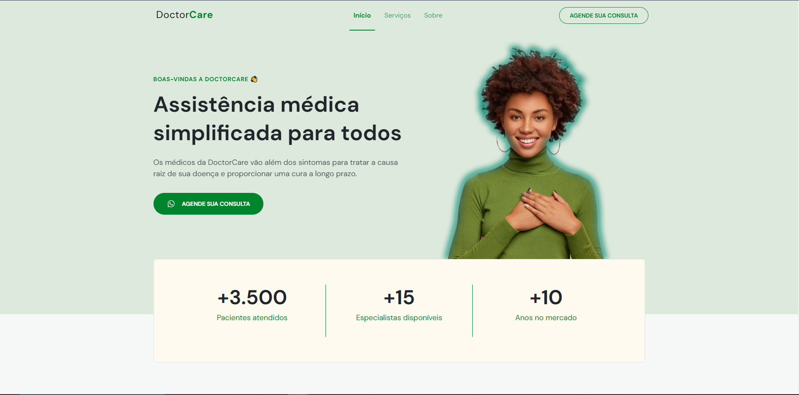

<h1 align="center">
  DoctorCare Responsive Website
</h1>

  

  <a href="#-tecnologias">Tecnologias</a>&nbsp;&nbsp;&nbsp;|&nbsp;&nbsp;&nbsp;
  <a href="#-projeto">Projeto</a>&nbsp;&nbsp;&nbsp;|&nbsp;&nbsp;&nbsp;
  <a href="#memo-licença">Licença</a>

 

## 🚀 Tecnologias

Esse projeto foi desenvolvido com as seguintes tecnologias:

- HTML
- CSS
- JavaScript

## 🚧 Projeto

Landing Page desenvolvida durante o NLW Return para aprendizado próprio:

Live Preview: https://souzagabriel26.github.io/DoctorCare-NLW/

## 🎨 Inspiração:

Figma: https://www.figma.com/file/XKmtWY86cMZLe1LiXnZL7r/DoctorCare-(Community)

Rocketseat: https://www.rocketseat.com.br/

## 📝 Licença

Esse projeto está sob a licença MIT. Veja o arquivo [LICENSE](LICENSE) para mais detalhes.

---

Feito com ♥ by Gabriel Alves
